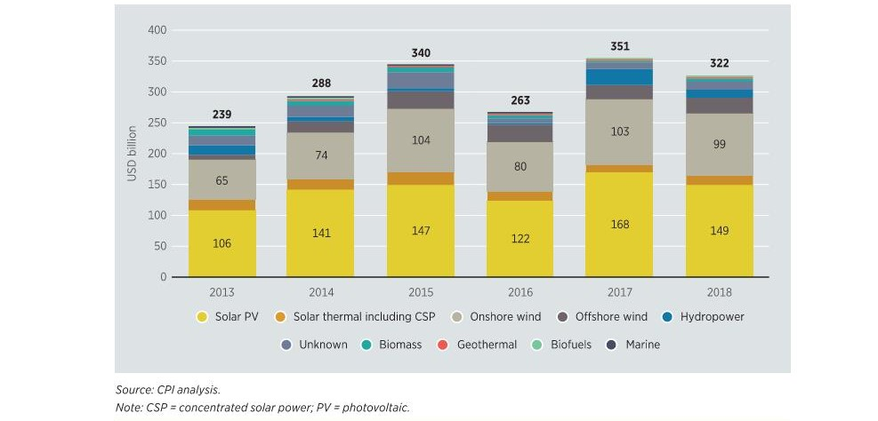
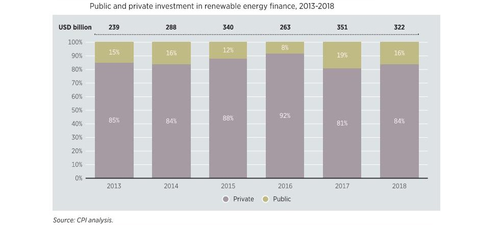
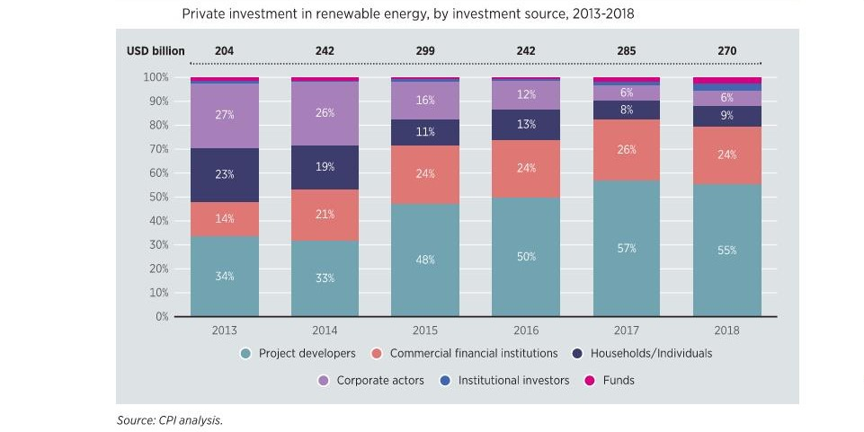
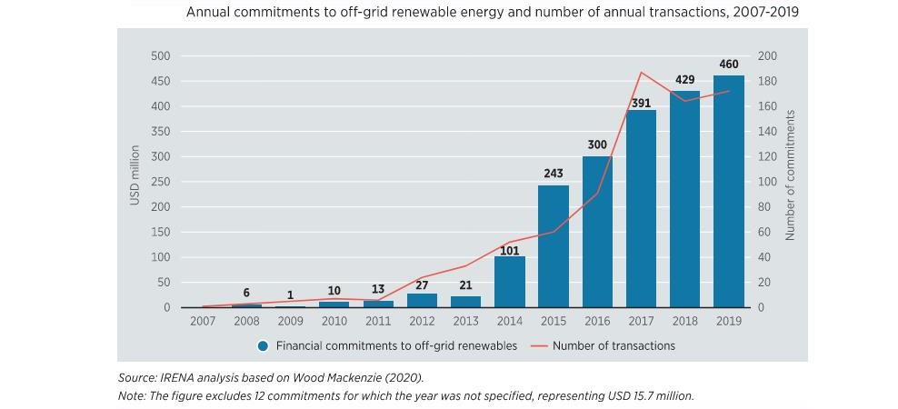
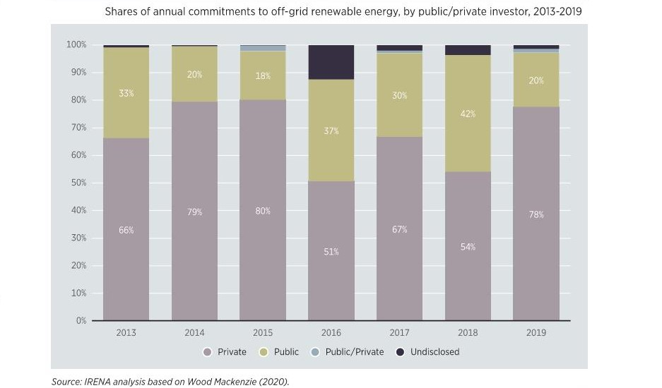
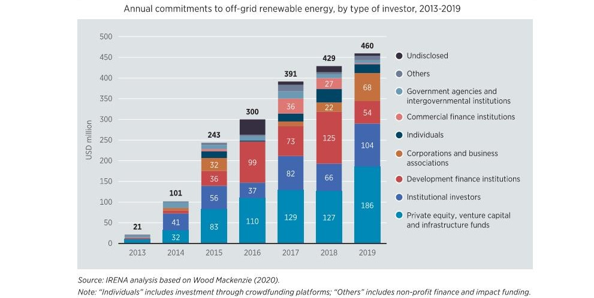
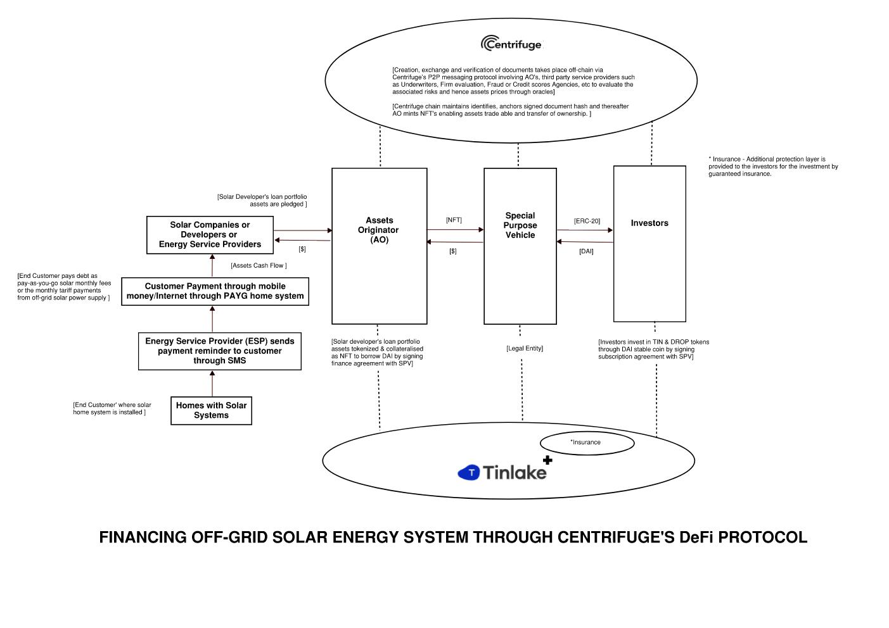

## Freelancers

*by @LBrian*

Freelancers represent about 35% of the global workforce and that number is expected to continue rising over the coming years. Amid the global COVID-19 Pandemic the number of freelance workers has continued to increase at a quickening pace. A study from Upwork found that in the USA alone freelancers earned approximately $1.2 trillion in 2020. Even with these impressive numbers, one of the primary concerns for freelancers is getting paid! Oftentimes (as Centrifuge is well aware) invoices do not get paid for 30-60 days. This can be a major challenge for individuals trying to run their own business and market their skills while keeping up on business and everyday expenses especially at the beginning of their freelance career. Also consider that 59% of freelance workers claim to be living paycheck to paycheck according to research by ddiy.com.This is where Centrifuge and Tinklake can help.

There are two ways that I could see these freelancer invoices onboarded to Centrifuge in order to receive cash advances on their invoices. A third party business could create a simple and attractive user interface with two separate portals: One for businesses employing freelancers and one for individual freelancers looking to submit their own invoices:

- For businesses employing freelancers: Multiple freelancers submit invoices to their employer → The employer uploads the batch of invoices that they have received for that week as well as any necessary documentation to their account on the third party website → The third party business batches multiple business accounts invoices and uploads those invoices to their Tinklake Pool to attract funding for stable coin advances on these invoices → The business receives the funding back in their preferred currency and pays their valued freelancers earlier than the typical 30-60 day payment window

- Individual freelancers upload their invoices as well as any necessary documentation to their account on the third party website → The third party business batches these individual invoices with others as well as multiple business account invoices and uploads those invoices to their Tinklake Pool to attract funding for stable coin advances on these invoices → The individual freelancer receives the payment for their invoice in their preferred currency earlier than the typical 30-60 payment window

**Sources:**

- https://www.upwork.com/i/freelancing-in-america/
- https://www.cnbc.com/2020/09/15/a-snapshot-of-the-1point2-trillion-freelance-economy-in-the-us-in-2020.html
- https://ddiy.co/freelance-statistics/#:~:text=Freelancers%20contribute%20about%20%241%20trillion,did%20with%20their%20previous%20jobs

## Purchasing Farmland

*by @LBrian*

Farmers employing regenerative practices to build healthy soil, healthy plants and healthy ecosystems lack access to financing and land ownership. First, a quick description of what regenerative agriculture is followed by some stats “The goal of regenerative farming systems (Rodale, 1983) is to increase soil quality and biodiversity in farmland while producing nourishing farm products profitably. Unifying principles consistent across regenerative farming systems include (1) abandoning tillage (or actively rebuilding soil communities following a tillage event), (2) eliminating spatio-temporal events of bare soil, (3) fostering plant diversity on the farm, and (4) integrating livestock and cropping operations on the land.” (LaCanne, Lundgren 2018)

- Farms with regenerative practices have shown to be 78% more profitable than those with only conventional practices. (LaCanne, Lundgren 2018)
- The Croation institute in their 2019 Soil Wealth report identifies “$321.1 billion in managed assets that explicitly integrate sustainable food criteria in their investment strategies, and a smaller subset of investments, $47.5 billion, specifically related to regenerative agriculture.”
- Over the last decade the average cost of farm real estate has more than doubled. Leading many farmers to rent instead of own their farmland. The largest economic incentives of regenerative farming practices pay off over the long term, usually beyond 10 years. Therefore land ownership is crucial for farmers using regenerative practices.
- 40% of farmland in the US is owned by farmers over 65. There is a large-scale land transfer happening at this very moment. Large scale developers and farms are buying up this land at high prices. How can small scale regenerative farmers take part in this land transfer to secure land for the long term?

**Where does Centrifuge come in?**

[Go Steward](https://gosteward.com/) is an interesting crowdfunding project providing loans to small scale regenerative farmers primarily in the United States(I do not work for Steward). Their model allows small farmers to access capital that they could not otherwise receive from traditional financing options. These loans allow them to purchase land, equipment and services. If a company like Steward or one that shares the same goals were to create a pool on Tinlake it could allow access to even more capital for small scale regenerative farmers to own their own land and produce healthy soil, food, ecosystems with meaningful profits in the long term.

There may be additional advantages to building a standalone app on Centrifuge chain to enable transparent on-chain reporting of funding, usage of funds, milestone achievements as well as potentially introducing on-chain reporting of data such as soil samples. I suppose this data could also be privately updated and transferred within the P2P network by updating the document connected to the NFT within Tinlake.

**Sources:**

- http://croataninstitute.org/images/publications/soil-wealth-2019.pdf
- https://www.ncbi.nlm.nih.gov/pmc/articles/PMC5831153/
- https://conservationfinancenetwork.org/2020/04/08/so-youre-thinking-of-investing-in-regenerative-food-systems
- https://www.youngfarmers.org/landaccess/
- https://gosteward.com/

## Car Rental Companies

*by qbbl#9103*

There are numerous car rental companies that operate around the world- both large corporations and small local enterprises. Car rental companies buy cars in a large volume directly from the manufacturers in a process known as Fleet Sales. Since they cut out the middleman, they do not pay a dealer's markup. In addition, they receive a volume discount from the manufacturers. The end result is that they get the cars at such a discount, that they can sell them at the end of the year as still relatively new cars, for about the same price they paid for it. This way, the rental companies get the cars essentially for free. However, they still need to produce the capital, through a loan, to buy the cars off the car manufacturers. There are many car rental companies that buy cars using long term, medium term and short term loans. This is where Centrifuge could step in and be very beneficial to raise capital for the car rental companies- allowing them to buy the cars needed. The Tinlake pool could finance a portfolio of car buying loans that are extended to car rental companies with a maturity of twelve to twenty four months depending on the timeframe of selling on the cars. The assets i.e. car purchase invoices could be originated onto the Centrifuge chain via tokenization. This could mean the physical world document would be replicated as an NFT, through a smart contract, and represents the document's inherent value. This could go from a NFT per order or get quite granular down to a per car level.

## Financing Solar Renewable Projects

*by Pats_Hardi*

### Introduction

Post covid scenario has resulted in more strain on national finance of vast majority of countries
across the globe. This has resulted in incumbent government’s facing the challenges to meet the
required financing critical to infrastructure projects. Several projects are halted or stopped due to
lack of financial support despite seeing the global demand of sustainable infrastructure projects. A
push towards a more resilient and sustainable economy to achieve net zero carbon emission goal
is on agenda propagated by governments for several nations as a path to economy recovery. These
are supported by robust renewable energy frameworks adopted by government agencies in several
countries. However, there is still a major infrastructure funding gap, and a low interest rate
environment pushing investors to seek returns in alternative asset classes. To resolve this challenge
of catering demand of financing sustainable infrastructure projects, alternative financial instruments
is envisaged through the medium of Decentralised Finance (DeFi). With over $30B dollars locked in
DeFi lending protocol and over $50B locked overall, it represents a perfect gateway at doorsteps to
a new financial world with minimal efforts. A paradigm shift from traditional finance to open-source
decentralised world would drastically reduce the number of intermediaries which shall attract more
capital and reduce cost. With trillions of dollars’ worth of real-world assets that has the potential to
be tapped into blockchain world, the outlook of finance industry is set to be globalised, decentralised
and interoperable using DeFi as an ultimate instrument.

### Focus - Renewable Energy Sector

The solar renewable energy system can either be on-grid or off-grid distribution system. A
decarbonised power sector, dominated by renewable sources, is at the core of transition to a
sustainable energy future. To ensure climate-safe future, annual investment in renewables would
have to almost triple to USD 800 billion by 2050. Additionally, governments through different green
initiative policies and packages can boost the confidence in renewable energy sector which will
attract more investment which is deemed essential to achieve the set target.

#### On-grid Solar Renewable System

In terms of financial commitments in renewable energy, Solar PV and Onshore Wind contributed
around 77% of total finance as per CSI analysis as shown in Figure 1.

While the renewable energy industry has established their footprints over more than a decade, its
continuous demand and growth has seen private clients/developers investing more owing to several
benefits from state/federal governments and utilities. Private investors finance in renewable energy
sector was more than public during 2013-2018 period as identified in Figure 2.

The renewable energy projects are financed through different private investments sources as shown
in Figure 3.

#### Off-Grid Solar Renewable System

Lack of affordable and reliable access to electricity is still major problem in many developing
countries of Africa, Asia, and other parts of world. In case of off grid renewables, it is estimated that
an annual investment of USD 45 billion in modern technology is required to achieve this
insurmountable task by 2030 through new financial instruments & approaches which shall provide
quick, cost-efficient, and efficient solution. Figure 4 below shows the population served by off-grid
renewable energy solutions globally.

The annual commitments to off-grid renewable energy is shown in Figure 5.

Investment in off-grid renewable system is dominated by private sector around 78%, followed by
public sector which is around 20%. However, despite surge in renewable energy financing,
investment in such solutions represents a very small portion of overall energy finance access.

Financing from private and public to off grid renewable energy is shown Figure 6 while Figure 7
shows annual financing based on investors.

From the above, it can be concluded that the off-grid solar renewable sector has plenty of space to
foster in future. With the advancement in technology in Solar PV, the overall cost of solar PV system
is decreasing and thereby making it more efficient and affordable by end customer. Parallelly, a
significant investment is envisaged to address the market requirements and thus enabling electricity
been offered to the rural end users.

### Tokenisation of Solar Renewable Energy Assets

#### Overview

Capital is required at different stage of project execution upstream, running, and downstream of
project to support the end-customers or for business transaction and this is addressed through
different financial instruments such as rural electrification assistance, funds, micro-financing, fiscal
instruments, and other mechanism such as project financing, equity or debt financing, assets-based
lending, non-resource financing, and supplier’s credit. While financing of both on-grid and off-grid
solar renewable energy assets is viable through traditional finance market, this section focuses on
proposal of off-grid solar assets being financed through the medium of DeFi as an alternative
approach.

#### Geographical Area

While the target geographical area shall be globally, the platform of DeFi, if applied to
underdeveloped or developing countries for off-grid renewable distribution system, shall resolve
basic problem of electricity and food for vast majority of population and hence in humanity in general.
In addition, the deployment of solar renewable assets would help to cut down carbon emission which

otherwise is massive owing to use of diesel-powered generators or kerosene or other source of non-
renewable source of energy in these regions. African countries are prime illustration of lack of basic

electricity and connecting end users with solar home system will help electrify rural areas there by
addressing significant climatic and social issues.

#### Financing Model

There are three different approaches for financing solar home system off grid system as stated
below

- Model 1 – Cash Sales.
- Model 2 – Credit Sales.
- Model 3 - Fee for services.

The cash sales model is where the end customer pays upfront for the entire solar system to the
dealer/developer while fee for services model involves Energy Service Provides (ESP’s)/solar

developer entities installs the entire system and sell electricity for associated service fees. The end-
user pays for connection fees and monthly charges based on the energy consumption (kWhr). Pay

As You Go (PAYG) Models embodies this model 3 concept where the end customer pays via mobile
money or buy prepaid card as per their budget for electricity requirements. While each stated model,
has its pros and cons along with associated risks, credit sales model is generally prevalent in
developing and under-developed countries such as African. In credit sales model, financing is either
by

- Energy Service Providers/Solar System Developer/ System Dealer or
- End user/consumer or
- Lease option is available by end customer.

In developer/dealer credit model, the PV supplier / system developer undertaking off-grid project
does not have the working capital required to offer credit to the end-user. Therefore, these entities
approach a funding source or credit provider to access credit (developer/dealer re-finance). This is
the one approach of solar off gird financing. Alternatively, in end-user credit model, the end
user/consumer engages with financial institutes or banks or local lending firms having experience
with rural credit to lend the finance for PV system. There is no involvement of PV system dealer or
developer in this mode and is only responsible for sales, distribution, and installation. A minimum
down payment is made by the end sure/consumer to the firms and the rest is loaned and paid back
as on agreed contract terms.

This section focuses on credit sales model where financing is made available to end customers
through credit lending institutes which in this case is targeted through DeFi.

#### Problem Statement

The solar developer usually performs turnkey project which includes financing, installation,
operation, and maintenance of solar home renewable system for end user/customers using
dealer/developer credit financing schemes. However, there is always a limitation to the available
cash on hand by these developers and hence requires additional financing from available financial
institutions. Additionally, there are several barriers faced by solar developers as listed below in terms
of accessing the liquidity from the market due to

- High collateralisation payment against the borrowed loan amount from available financial
instrument
- Limited accessibility to credit finance by local banks, or non-bank credit companies.
- An illiquid market leads to high interest rates on borrowed amount.
- Conflict risk
- Political uncertainty

#### Mitigation Proposal Strategy

In order to boost off-grid solar system development, the solar developer’s loan portfolio is used as
collateral to obtain the required capital flow. Likewise, a pool containing loans from multiple
developers can be tokenised and used as collateral in Tinlake or Centrifuge’ DApp to finance solar
home system. Additionally, insurance is proposed for the investor’s fund for attaining investor’s
confidence for pool financing. Figure 8 shows the model how the Centrifuge DeFi protocol shall help
finance the off grid solar market.

#### Execution challenges
To solve the liquidity issue for solar developers, a tokenised and collateralisation method has shall
be proposed using Centrifuge DeFi protocol whereby solar developer has substantiable access to
finance and resulting in deeper penetration in the solar market. The methodology of intervention
envisages pooling of solar home system loan into tradeable assets backed with solar PV system
used as collateral. However, there might several challenges faced while unleashing this strategy

- Underwrites needs to work with the solar developer to standardize project documents, contract
documents, product warranties, maintenance, collateral, insurance, etc to reduce transaction and
due diligence cost.
- Cooperation from solar companies is required for loan portfolio assessment due to confidentiality.
- Currency fluctuation can affect in financing in local currency if the case. So, this issue needs to
be addressed by hedging the investment.
- Lack of government’s clear electrification strategy in rural area.

#### Fusion

In addition to above proposed strategy, financing off grid solar renewables through fusion with
several different platforms would be worth evaluating and exploration opportunities

- Crowdfunding typically via internet base platform is another potential opportunity. While donation
and reward model of crowd funding is prevalent in developing countries, debit crowdfunding is
more predominant in developed countries. Potential integration with authentic crowdfunding solar
renewable funding platforms can be beneficial.
- Integration with Off grid solar MNC organisations, with implemented and working PAYG model,
and having footprint in Africa such as M/s BBOXX; M/s ENGIE; M/s Angaza and other local
country specifics would be advantages.
- Centrifuge has partnered with USDC in 2018 to bring crypto adoption to masses in financial
supply chain. Deployment of USDC as stable coin as means of transaction would be an added
advantage due to USDC’s integration with Visa and hence bolster protocol adoption.
- Potential integration with M/s Tala, providing financial services to the customers through
smartphone app enabling quick crypto adoption. This is help in ease of use of financing solar off
grid customers.
- Integration with NEoT Off grid Africa, an investment platform established by Meridiam, EDF and
Mitsubishi Corporation for supporting mini-off grid solar system portfolio.

### Conclusion

Based on the above, the following can be concluded:

To solve the liquidity issue for solar developers, a tokenised and collateralisation method has
been proposed which envisages pooling of solar home system loans into tradeable assets backed
with solar PV system used as collateral through the medium of Centrifuge’s DApp protocol
whereby solar system developer has substantiable access to finance which results in deeper
penetration in the solar market.

## Build a Use Case

Welcome to the bonus mission of Discord missions!
Submit a PR to our documentation under this section and provide a potential use case that Centrifuge can tap into, using the following categories:

- **Through the lens of an asset originator**
  - Which markets around the world could benefit most from asset financing through centrifuge?
- **DeFi protocol composability**
  - Centrifuge has started working with MakerDAO and Aave to create instant liquidity for Tinlake pools. What are other great partnership use cases for Centrifuge?
- **Centrifuge Chain (the home for RWA)**
  - Centrifuge Chain is built for RWA origination. Tinlake is a great use case of what can be done with the Centrifuge chain. What are some other cases you can see for the Centrifuge chain?
- **Polkadot**
  - Interoperability is crucial for DeFi’s success. What are some other projects in the Polkadot ecosystem that you think Centrifuge should integrate with?

For any of these categories above 👉 submit a PR to detail how each use case could work. Make sure to think about the entire flow, technology, and size of the potential!
