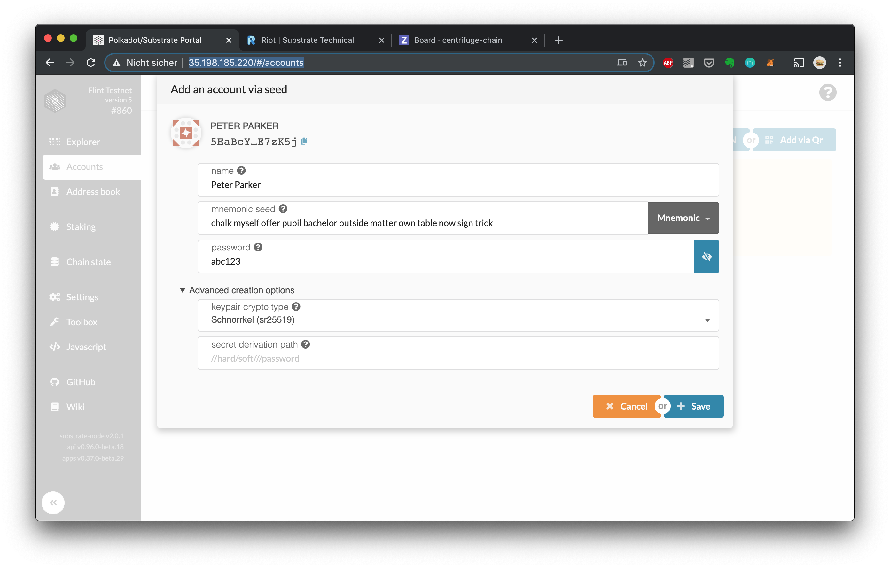

DISCLAIMER: _Use of this guide is at your own risk. To the maximum extent permitted by applicable law, the services are provided without warranties of any kind, whether express, implied, statutory or otherwise, including, but not limited to, implied warranties of merchantability, fitness for a particular purpose, title, quiet enjoyment, accuracy, or non-infringement. Further, to the fullest extent allowed by applicable law, in no event shall the company or its affiliates, be liable to you or any third party for any damages of any kind._

A Centrifuge Chain address can be created through the [Centrifuge Portal](https://portal.chain.centrifuge.io/#/accounts), the [Polkadot browser extension](https://polkadot.js.org/extension/), or through [Parity Signer](https://www.parity.io/signer/).

## Using the Portal UI
**Of all options, this is the least secure and is not recommended.**

1. Open the Portal at https://portal.chain.centrifuge.io/#?rpc=wss://fullnode.centrifuge.io
1. Create a new account for your user by navigating to "Accounts" and clicking "Add account".

   Fill in the form, e. g. for Peter Parker: 

1. Click "Save" and then "Create and backup account". Make sure you save the downloaded JSON file in a safe place.

1. Done! You can now copy your address and send it to others to receive tokens. The address is the string starting with `4...` for Mainnet or `5...` for Amber or Flint under the name of your account, e. g. `5HKk5u...wp29Zd` in the following. You can copy it by clicking on the icon to the left of your account name: 

## Using the Polkadot.js extension

1. Download the extension [here](https://polkadot.js.org/extension/)
1. Create a new account by clicking on "+" in the top right of the extension and selecting "Create new account"
1. Save your recovery phrase in a safe place before you continue (**THIS IS VERY IMPORTANT**)
1. Set a name and password for this account
1. Once created, backup the account by selecting the 3 dots to the right of the account name and clicking "Export Account"
1. Make sure you save the downloaded JSON file in a safe place, and remember the password for this account
1. Done! You can now copy your address and send it to others to receive tokens.

## Create an account using the Parity Signer App

This is an unofficial guide on how to use the Parity Signer App to create an account on Centrifuge Chain. Please consult the official Parity Signer documentation [here](https://github.com/paritytech/parity-signer).

### How to connect to Centrifuge Chain Mainnet

1. Open the Portal Website on your computer at: https://portal.chain.centrifuge.io/
2. In the top left, ensure that the Newtork is set to 'Centrifuge Mainnet'

### How to Generate an Address Using Parity Signer

1. Buy an old or new device (ex. ipod touch, android phone, etc.)
     - **Important** only charge it with a battery bank or wall charger, **don’t plug it into a computer!!!** Use a charge only cable, not a data cable.
1. Set up a passcode and set it to wipe the device upon entering the code incorrectly too many times.
1. Install the [Parity Signer App](https://www.parity.io/signer/) from below links:
     - [Link for apple device](https://itunes.apple.com/us/app/parity-signer/id1218174838)
     - [Link for android device](https://play.google.com/store/apps/details?id=io.parity.signer)
1. Never connect the the device to a computer, even to upgrade it.
1. Turn off wifi & bluetooth (**NEVER TURN IT ON AGAIN!**)
1. Create a key for Centrifuge Mainnet using the Parity Signer App
     - Create your identity to get started
     
     - Write down your 24 word Recovery Phrase (**THIS IS VERY IMPORTANT**)
     
     - Set your Identity PIN
       - **You will use this PIN to sign all of your transactions using this device.**
     - Create your first Keypair - select the Centrifuge Mainnet Network
     
1. Get your address by scanning the QR code on the Portal Website.
     - On your computer, navigate to https://portal.chain.centrifuge.io/
     - Make sure the network is set to 'Centrifuge Mainnet'
     - Click on Accounts
     - Click on 'Add via QR'
       
     - Scan the QR code on your device for your Centrifuge Mainnet Public Address
       
     - Your address for Centrifuge Mainnet should begin with a '4...'
1. To manually check the above process:
     - Delete the key from the app
     - Recover the key from your backed up phrase
     - Verify the address matches what you obtained above

1) Send some test CFG to another address and use Parity Signer to sign this transaction
     - You will first need to send some CFG to this account
     - Initiate a transfer on the Portal Website by selecting 'Transfer' in the left menu or on 'Send' from the Accounts page
     - Click 'Make Transfer'
     - Click 'Sign via QR'
     - Using the Parity Signer App, scan the QR code in your browser with the App's QR Scanner from this account screen (see above on how to get it).
     - In the app, confirm your signature of the transaction by entering your PIN
     - Click 'Scan Signature QR' in the browser
     - Sign the transaction

1) Backup your Recovery Phrase and keep it somewhere safe. Please do research on secure methods for storage and recovery.

> **A note on app updates:**
> If a new version of the app becomes available, please exercise the following caution.
> Ideally, replace the device or do not update the app.
> If an update is necessary:
>
> 1.  Hard reset the device and wipe everything
> 2.  Re-install the new parity signer app
> 3.  Turn off wifi & bluetooth and **NEVER TURN IT ON AGAIN**
> 4.  Recover your key from seed phrase

- **Remember to write down your secret phrase & STORE IT SAFELY!**
  Follow a secure protocol to save and store your private keys. Please do some research and choose a secure method that will work best for you.

